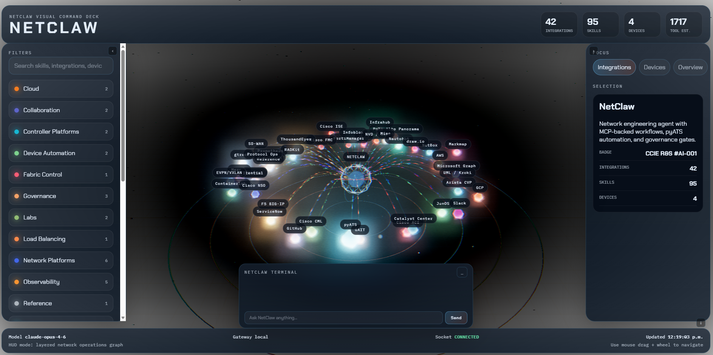

<p align="center">
  
</p>

# NetClaw Visual HUD

A Three.js 3D network operations dashboard for [NetClaw](https://github.com/automateyournetwork/netclaw). Visualizes all 44 MCP integrations, 97 skills, your device fleet, and live BGP peering topology in a real-time interactive scene. Includes a chat terminal wired directly to the OpenClaw gateway for live tool execution from the browser. Supports bidirectional Slack and WebEx channels.

---

## Table of Contents

1. [Build and Install NetClaw](#1-build-and-install-netclaw)
2. [Start the OpenClaw Gateway](#2-start-the-openclaw-gateway)
3. [Local BGP Peering (Optional)](#3-local-bgp-peering-optional)
4. [Peer with Other NetClaws (Optional)](#4-peer-with-other-netclaws-optional)
5. [Start the Visual HUD](#5-start-the-visual-hud)
6. [Using the HUD](#6-using-the-hud)
7. [Architecture](#architecture)
8. [API Reference](#api-reference)
9. [Troubleshooting](#troubleshooting)

---

## 1. Build and Install NetClaw

Before running the HUD, you need a working NetClaw installation with the OpenClaw gateway configured.

### Prerequisites

- **Node.js** 18+ and npm
- **Python** 3.10+
- **OpenClaw** CLI (`pip install openclaw` or via the install script)

### Clone and Install

```bash
git clone https://github.com/automateyournetwork/netclaw.git
cd netclaw
./scripts/install.sh
```

The installer runs two setup phases:

**Phase 1: `openclaw onboard`** (OpenClaw's built-in wizard)
- Pick your AI provider (Anthropic, OpenAI, Bedrock, Vertex, 30+ options)
- Set up the gateway (local mode, auth, port)
- Connect channels (Slack, WebEx, Discord, Telegram, etc.)
- Install the daemon service

**Phase 2: `./scripts/setup.sh`** (NetClaw platform credentials)
- Network devices (testbed.yaml editor)
- Platform credentials (pyATS, NetBox, ACI, ISE, ServiceNow, GitHub, Meraki, etc.)
- Your identity (name, role, timezone for USER.md)

### Configuration Files

After setup, your configuration lives in:

| Path | Purpose |
|------|---------|
| `~/.openclaw/openclaw.json` | Gateway config — auth token, port, channels |
| `~/.openclaw/.env` | All integration credentials and API keys |
| `netclaw/testbed/testbed.yaml` | Device inventory for pyATS |
| `netclaw/IDENTITY.md` | NetClaw identity, ASN, creature type |
| `netclaw/SOUL.md` | Agent personality and operating instructions |

Reconfigure anytime:
- `openclaw configure` — AI provider, gateway, channels
- `./scripts/setup.sh` — network platform credentials

---

## 2. Start the OpenClaw Gateway

The HUD's chat terminal proxies messages to the OpenClaw gateway. Start it in a dedicated terminal:

```bash
cd netclaw
openclaw gateway run
```

You should see:

```
[gateway] listening on ws://127.0.0.1:18789
[gateway] agent model: anthropic/claude-sonnet-4-6
```

The gateway must be running for live chat responses and tool execution (Slack messages, GitHub issues, ServiceNow tickets, mind maps, etc.). Without it, the chat falls back to a local heuristic that identifies which integrations and devices are relevant but cannot execute tools.

The HUD shows a **LIVE** / **OFFLINE** indicator in the chat header so you always know if the gateway is reachable.

---

## 3. Local BGP Peering (Optional)

NetClaw includes a pure-Python BGP daemon (AS 65001) and a Docker-based FRR router lab. When running, the HUD automatically discovers BGP peers and renders them as equal core nodes alongside the local NetClaw in the 3D scene.

### A. Start the FRR Router Lab

The lab creates three FRR routers (Edge1, Core route reflector, Edge2) in AS 65000 with OSPF + iBGP, connected to your host via a GRE tunnel.

```bash
cd netclaw/lab/frr-testbed
docker compose up -d
sleep 15                          # wait for OSPF/BGP convergence
sudo bash scripts/setup-gre.sh   # create GRE tunnel from host to Edge1
bash scripts/verify.sh            # confirm everything is up
```

```
Topology:

NetClaw (AS 65001)     Edge1 (AS 65000)     Core (RR)     Edge2 (AS 65000)
  host / WSL           1.1.1.1              2.2.2.2       3.3.3.3
  172.16.0.2 ──GRE──── 172.16.0.1
                       eBGP ↔ NetClaw       iBGP hub      iBGP spoke
```

### B. Start the BGP Daemon

```bash
cd netclaw/mcp-servers/protocol-mcp
pip install -r requirements.txt

export NETCLAW_ROUTER_ID="4.4.4.4"
export NETCLAW_LOCAL_AS="65001"
export NETCLAW_BGP_PEERS='[{"address":"172.16.0.1","remote_as":65000}]'

python bgp-daemon-v2.py
```

The daemon exposes an HTTP API on `localhost:8179`:

| Endpoint | Method | Description |
|----------|--------|-------------|
| `/peers` | GET | BGP peer state (ASN, router-id, state, timers) |
| `/rib` | GET | Full RIB (Adj-RIB-In from all peers) |
| `/status` | GET | Daemon status and uptime |
| `/inject` | POST | Inject a route: `{"network":"10.99.99.0/24","next_hop":"172.16.0.2"}` |
| `/withdraw` | POST | Withdraw a route: `{"network":"10.99.99.0/24"}` |

### C. Verify Peering

```bash
# Check peering is Established
curl -s http://localhost:8179/peers | python3 -m json.tool

# Check received routes
curl -s http://localhost:8179/rib | python3 -m json.tool
```

### D. Teardown

```bash
sudo bash scripts/teardown-gre.sh
docker compose down
```

---

## 4. Peer with Other NetClaws (Optional)

Multiple NetClaw instances can peer with each other over BGP. Each NetClaw runs its own BGP daemon with a unique AS number. When peered, both HUDs show each other as core nodes with routes fanning out as dendrite wires.

### Remote Peering via ngrok

On the remote NetClaw host, expose the BGP port:

```bash
ngrok tcp 179
```

On the local NetClaw, add the ngrok endpoint as a BGP peer:

```bash
export NETCLAW_BGP_PEERS='[
  {"address":"172.16.0.1","remote_as":65000},
  {"address":"X.tcp.ngrok.io","remote_as":65002,"remote_port":NNNNN}
]'
python bgp-daemon-v2.py
```

### Direct Peering

If both NetClaws are on the same network or have direct IP connectivity:

```bash
export NETCLAW_BGP_PEERS='[
  {"address":"172.16.0.1","remote_as":65000},
  {"address":"192.168.1.50","remote_as":65002}
]'
python bgp-daemon-v2.py
```

The HUD renders all BGP peers as equal core nodes in a triangular layout — local NetClaw on the left, peer nodes on the right — each with its received routes displayed as animated dendrite wires.

---

## 5. Start the Visual HUD

### Install Dependencies

```bash
cd netclaw/ui/netclaw-visual
npm install
```

### Development Mode

```bash
npm run dev
```

This starts two processes concurrently:

| Process | Port | Purpose |
|---------|------|---------|
| **API Server** | 3001 | REST API + WebSocket for graph data, BGP state, chat proxy, device config |
| **Vite Dev Server** | 3000 | Three.js frontend with hot reload, proxies `/api` and `/ws` to port 3001 |

Open **http://localhost:3000** in your browser.

### Production Build

```bash
npm run build
npm run preview
```

### What You Need Running

| Component | Required | Command | Purpose |
|-----------|----------|---------|---------|
| **HUD** | Yes | `npm run dev` | The dashboard itself |
| **OpenClaw Gateway** | For live chat | `openclaw gateway run` | AI-powered tool execution |
| **BGP Daemon** | For topology | `python bgp-daemon-v2.py` | BGP peer discovery + routes |
| **FRR Lab** | For router peering | `docker compose up -d` | Lab routers to peer with |

---

## 6. Using the HUD

### The 3D Scene

The center of the HUD is a Three.js 3D scene. Use your mouse to navigate:

| Action | Control |
|--------|---------|
| **Orbit** | Click and drag |
| **Zoom** | Scroll wheel |
| **Select node** | Click on a node |
| **Deselect** | Click the local NetClaw core or empty space |

### Core Nodes

The scene displays up to three central core nodes in a triangular arrangement:

- **NetClaw (Local)** — your local instance, with all 43 integrations orbiting around it as colored spheres connected by animated data-flow tubes
- **Peer NetClaw** — another NetClaw instance you're peered with via BGP (magenta tint), with received routes fanning out as dendrite wires
- **Router** — a traditional router peer like FRR Edge1 (cyan tint), also showing its advertised routes

All core nodes have the same visual treatment: icosahedron shell, glowing nucleus, rotating torus rings, and a label. Magenta tubes connect the cores to show BGP peering links.

### Integration Nodes

Each of the 43 MCP integrations is rendered as a sphere orbiting the local core, color-coded by category:

| Color | Categories |
|-------|-----------|
| Cyan | Cloud, Device Automation |
| Green | Source of Truth, Governance |
| Orange | Security, Fabric Control |
| Magenta | Observability, Network Platforms |
| Yellow | Labs, Visualization |
| White | Reference, Utilities |

Click any integration node to see its skills, estimated tool count, and configuration status in the right sidebar detail panel.

### Device Nodes

Devices from your `testbed.yaml` appear as smaller nodes connected to the local core. Click a device to see its hostname, OS, platform, IP, and connection details.

### Chat Terminal

The chat drawer in the bottom-right corner connects directly to the OpenClaw gateway:

1. Type a message like `check R1 interfaces make a github report and send a slack message` or `send a WebEx alert about R2 CPU`
2. The HUD identifies which integrations are relevant (pyATS, GitHub, Slack, WebEx) and lights them up in the 3D scene
3. Animated beams fire from the local core to each activated integration
4. The gateway executes the actual tools (runs pyATS commands, creates GitHub issues, sends Slack messages)
5. The response appears in the chat with a **LIVE** badge

If the gateway is offline, responses fall back to a local heuristic with a **LOCAL** badge that identifies relevant integrations and devices but cannot execute tools.

The chat header shows:
- **LIVE** (green) — gateway is reachable and responding
- **OFFLINE** (orange) — gateway is not running or unreachable

### Top Bar Metrics

The header displays real-time counts:
- **Integrations** — number of configured MCP integrations
- **Skills** — total skills loaded from workspace/skills/
- **Devices** — devices in your testbed.yaml
- **Tool Est.** — estimated total tools across all integrations

### Left Sidebar — Filters

- **Search** — filter integrations and devices by name
- **Category toggles** — show/hide integration groups (Cloud, Security, Governance, etc.)
- **Settings** — view and edit integration configuration

### Right Sidebar — Detail Panel

Three focus tabs at the top:
- **Integrations** — list of all integrations, click to inspect
- **Devices** — list of all testbed devices, click to inspect
- **Overview** — summary of all core nodes, BGP state, and route counts

The detail panel below shows context for the selected node:
- **Integration selected**: skills, tools, config status, category
- **Device selected**: hostname, OS, platform, IP, credentials status
- **Peer core selected**: ASN, router-id, BGP state, Adj-RIB-In route table with prefix, next-hop, and AS path

### Footer — Status Bar

- **Model** — the AI model powering the gateway
- **Gateway** — gateway connection status
- **Socket** — WebSocket connection state (CONNECTED / RECONNECTING)
- **Updated** — timestamp of last data refresh

---

## Architecture

```
Browser (Three.js HUD @ localhost:3000)
    |
    +-- GET  /api/graph          -> integrations, skills, devices, tool counts
    +-- GET  /api/bgp            -> BGP peers + RIB from daemon (localhost:8179)
    +-- GET  /api/gateway/status -> OpenClaw gateway health check
    +-- POST /api/chat           -> proxied to OpenClaw gateway (localhost:18789)
    +-- GET  /api/testbed/raw    -> read/edit testbed.yaml
    +-- PUT  /api/env            -> update integration credentials
    +-- WS   /ws                 -> real-time activations, BGP state, heartbeat
    |
    +-- API Server (Express @ localhost:3001)
    |     +-- Reads ~/.openclaw/ for gateway config and credentials
    |     +-- Reads workspace/skills/ for skill catalog
    |     +-- Reads testbed/testbed.yaml for device inventory
    |     +-- Polls BGP daemon at localhost:8179
    |
    +-- OpenClaw Gateway (@ localhost:18789)
          +-- Anthropic Claude (agent model)
          +-- 43 MCP integrations (pyATS, ACI, ISE, NetBox, GitHub, Slack, ...)
          +-- 97 skills (health checks, troubleshooting, auditing, ...)
```

---

## API Reference

| Endpoint | Method | Description |
|----------|--------|-------------|
| `/api/health` | GET | Health check |
| `/api/graph` | GET | Full integration + device graph for 3D visualization |
| `/api/bgp` | GET | BGP peer state and RIB from daemon |
| `/api/gateway/status` | GET | OpenClaw gateway online/offline check |
| `/api/skill/:skillId` | GET | Individual skill details |
| `/api/env/:integrationId` | GET | Integration environment variables |
| `/api/env` | PUT | Update integration credentials |
| `/api/testbed/raw` | GET | Read testbed.yaml |
| `/api/testbed/raw` | PUT | Update testbed.yaml |
| `/api/chat` | POST | Send chat message (proxied to OpenClaw gateway) |
| `/api/chat/history` | GET | Chat message history |
| `/api/sessions` | GET | OpenClaw agent sessions |
| `/api/session/:id/tools` | GET | Tools used in a session |

---

## Troubleshooting

**Chat shows LOCAL instead of LIVE**
- Verify the gateway is running: `curl http://127.0.0.1:18789/v1/models`
- Check the gateway status indicator in the chat header (LIVE/OFFLINE)
- Complex multi-tool queries can take 2-3 minutes — the timeout is set to 5 minutes

**No BGP peers in the visualization**
- Verify the BGP daemon is running: `curl http://localhost:8179/peers`
- Check that peers show `"state": "Established"`
- If using the FRR lab, ensure GRE tunnel is up: `ping 172.16.0.1`

**Integrations show zero tools**
- Run `./scripts/setup.sh` to configure integration credentials
- Check `~/.openclaw/.env` for required API keys and tokens

**HUD won't load**
- Check both processes are running: API on 3001, Vite on 3000
- Look at browser console for Three.js or WebSocket errors
- Verify `npm install` completed without errors

**Scene is blank or nodes are missing**
- Check browser console for `fetch` errors to `/api/graph`
- Ensure the API server started (look for `NetClaw visual API listening on http://localhost:3001`)
- Try a hard refresh (Ctrl+Shift+R)
